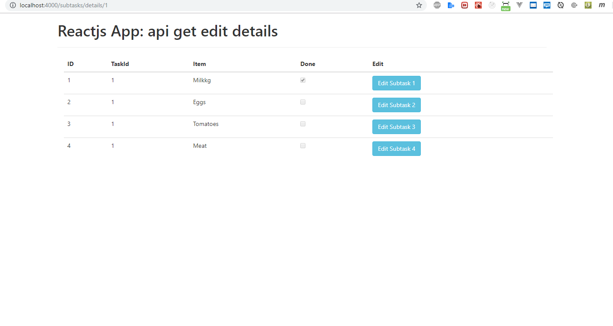
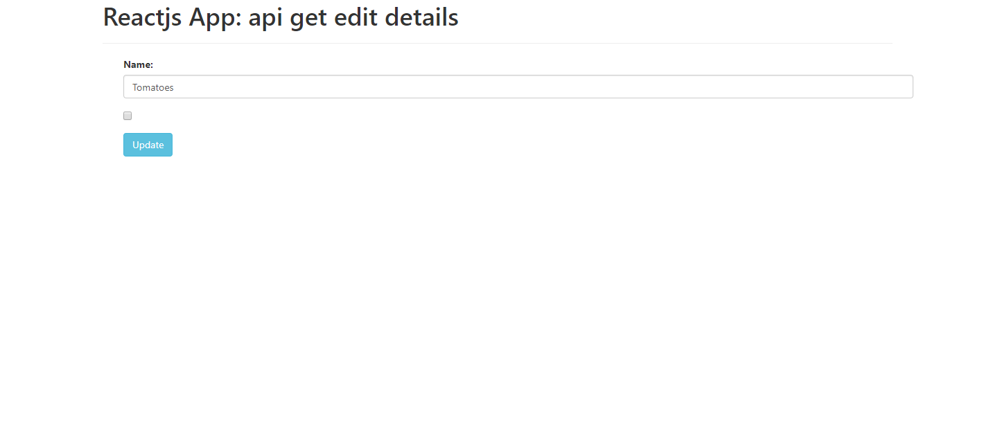

For running this code , you need to do following

First
________
The API is already prepared for you and is based on the json-server npm library (https://github.com/typicode/json-server)
which takes the db.json file and creates an HTTP server based on it.

You simple install the json-server library via the following npm command:
$ npm install -g json-server
and then start the server:
$ json-server --watch db.json
This should start the HTTP server on http://localhost:3000

Second 
__________
You need to install node module by npm install
then by npm start 
This should start the HTTP server http://localhost:4000

Please see the screenshot to see the view

